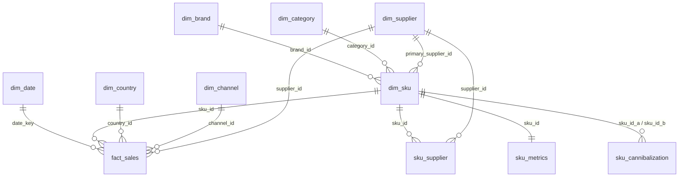

# Data Model Specification

**Status:** Design — no tables created yet
**Date:** 9 September 2026
**Scope:** Logical and physical data model for the FMCG sales dataset. Defines every
table, column, data type, primary key, foreign key, and constraint required before any
data is generated or any database is provisioned.

**Companion document:** [`dataset_generation_plan.md`](dataset_generation_plan.md) — the
generation rules and reconciliation targets. This document defines *the shape*; that one
defines *the values*.

---

## 0. Scope and reading order

This model covers the **sales transaction dataset** — the 38 columns documented in
`docs/FMCG Multi-Country Sales Dataset — Column Reference.docx`, normalised into a star
schema with derived-metric tables layered on top.

It does **not** cover the launch pipeline or competitor intelligence. Both are named in
§11 as deferred, with a note on why they don't belong in this model.

| Section | Contents |
| --- | --- |
| §1 | Model overview and entity diagram |
| §2 | Naming and type conventions |
| §3 | Dimension tables (7) |
| §4 | Bridge table (1) |
| §5 | Fact table (1) |
| §6 | Derived metric tables (4) |
| §7 | Views |
| §8 | Complete key map — every PK and FK |
| §9 | Source column traceability — all 38 columns mapped |
| §10 | Index plan |
| §11 | Deferred entities |
| §12 | Open decisions |

---

## 1. Model overview

A classic **star schema**: one transaction fact table surrounded by conformed
dimensions, with derived metrics held in separate tables because they are computed at a
different grain (per SKU, or per portfolio snapshot) than the facts.



### Table inventory

| # | Table | Type | Grain | Est. rows |
| --- | --- | --- | --- | ---: |
| 1 | `dim_date` | Dimension | One row per calendar day | 731 |
| 2 | `dim_country` | Dimension | One row per market | 7 |
| 3 | `dim_channel` | Dimension | One row per sales channel | 4 |
| 4 | `dim_category` | Dimension | One row per product category | 7 |
| 5 | `dim_brand` | Dimension | One row per brand | 6 |
| 6 | `dim_supplier` | Dimension | One row per supplier | 60 |
| 7 | `dim_sku` | Dimension | One row per SKU | 119 |
| 8 | `sku_supplier` | Bridge | One row per SKU × supplier | 7,140 |
| 9 | `fact_sales` | Fact | One row per SKU × country × channel × day | ~368,000 |
| 10 | `sku_metrics` | Derived | One row per SKU | 119 |
| 11 | `sku_cannibalization` | Derived | One row per SKU pair within a category | 1,153 |
| 12 | `portfolio_metrics` | Derived | One row per snapshot | 1+ |
| 13 | `rationalization_scenario` | Derived | One row per simulation scenario | 4 |

---

## 2. Conventions

### Naming

| Convention | Rule |
| --- | --- |
| Case | `snake_case` throughout — tables, columns, constraints |
| Dimension prefix | `dim_` |
| Fact prefix | `fact_` |
| Derived tables | No prefix (`sku_metrics`, `portfolio_metrics`) |
| Surrogate keys | `<entity>_id` |
| Primary key constraint | `pk_<table>` |
| Foreign key constraint | `fk_<table>_<referenced>` |
| Unique constraint | `uq_<table>_<columns>` |
| Check constraint | `ck_<table>_<rule>` |

### Data types

| Kind of value | Type | Why |
| --- | --- | --- |
| Money (row level) | `NUMERIC(12,2)` | Exact decimal. **Never `FLOAT`/`REAL` for currency** — binary floats cannot represent cents exactly and margin sums would drift |
| Money (aggregate) | `NUMERIC(14,2)` | Portfolio totals reach ~$473,000,000.00 — needs the wider precision |
| Unit price / cost | `NUMERIC(10,2)` | Per-unit amounts |
| Ratio / percentage | `NUMERIC(6,4)` | Stored as a **fraction** (0.3853 = 38.53%), not as 38.53. Four decimals matches the source precision |
| Correlation | `NUMERIC(5,4)` | Range −1.0000 to 1.0000 |
| Unbounded ratio | `NUMERIC(8,4)` | `op_burden_ratio` reaches 3.58 |
| Units sold | `INTEGER` | Whole units |
| Lead time | `NUMERIC(5,2)` | Fractional days |
| Small FK ids | `SMALLINT` | ≤ 60 rows in every case |
| SKU id | `INTEGER` | Room to grow beyond 119 |
| Fact surrogate key | `BIGINT GENERATED ALWAYS AS IDENTITY` | SQL-standard, preferred over legacy `SERIAL` |
| Dates | `DATE` | No time component — the grain is daily |
| Controlled vocabulary | `TEXT` + `CHECK` | See below |

**Currency:** all monetary columns are **USD**. There is no currency column and no FX
table — resolved 7 Sep 2026. See `dataset_generation_plan.md` §3.1 decision 8.

### Controlled vocabularies

Three fields have a fixed set of values. Modelled as `TEXT` with a `CHECK` constraint
rather than a PostgreSQL `ENUM`:

| Field | Allowed values |
| --- | --- |
| `volatility_class` | `Stable`, `Variable`, `Unstable` |
| `portfolio_segment` | `Keep`, `Grow`, `Consolidate`, `Rationalize` |
| `complexity_label` | `High`, `Medium`, `Opt` |

*Rationale:* `CHECK` is portable, readable in `\d` output, and extendable with a plain
`ALTER TABLE`. `ENUM` would be marginally more compact but requires `ALTER TYPE` to
change and complicates ordering. These values also pass straight through to the UI as
strings, so there's no benefit to an integer-backed type.

### Nullability

Default is `NOT NULL`. A column is nullable only where absence is *meaningful*, and each
such case is flagged in the tables below with the reason.

---

## 3. Dimension tables

### 3.1 `dim_date`

Standard date dimension. Pre-computing the calendar parts avoids repeated `EXTRACT()`
in every aggregate query and lets the month/quarter columns be indexed.

| Column | Type | Null | Key | Description |
| --- | --- | --- | --- | --- |
| `date_key` | `DATE` | NO | **PK** | The calendar date. Natural key — no surrogate needed |
| `year` | `SMALLINT` | NO | | 2024 or 2025 |
| `quarter` | `SMALLINT` | NO | | 1–4 |
| `month` | `SMALLINT` | NO | | 1–12 |
| `month_name` | `TEXT` | NO | | `January`…`December`, for display |
| `week` | `SMALLINT` | NO | | ISO week, 1–53 |
| `day_of_week` | `SMALLINT` | NO | | 0 = Sunday … 6 = Saturday |
| `is_weekend` | `BOOLEAN` | NO | | Derived from `day_of_week`; channel mix shifts at weekends |

**Range:** `2024-01-01` → `2025-12-31` (731 rows - 2024 is a leap year). Two complete years so
`revenue_growth` (2024 → 2025) is computable.

**Constraints**
```sql
CONSTRAINT pk_dim_date       PRIMARY KEY (date_key),
CONSTRAINT ck_dim_date_month CHECK (month   BETWEEN 1 AND 12),
CONSTRAINT ck_dim_date_qtr   CHECK (quarter BETWEEN 1 AND 4),
CONSTRAINT ck_dim_date_dow   CHECK (day_of_week BETWEEN 0 AND 6)
```

---

### 3.2 `dim_country`

| Column | Type | Null | Key | Description |
| --- | --- | --- | --- | --- |
| `country_id` | `SMALLINT` | NO | **PK** | Surrogate key |
| `country_name` | `TEXT` | NO | UQ | Italy, Spain, Germany, France, Austria, Poland, Netherlands |
| `region` | `TEXT` | NO | | `Southern Europe`, `Western Europe`, `Central Europe` |
| `complexity_label` | `TEXT` | NO | | `High` / `Medium` / `Opt` — from `REGIONAL_DATA` |
| `listed_sku_count` | `SMALLINT` | NO | | Target SKUs listed in this market (119/114/93/52) |
| `revenue_share_target` | `NUMERIC(6,4)` | NO | | Share of portfolio revenue this market should carry. Used by the generator's calibration loop |

**Seed values** (7 rows) — from `src/constants/data.ts` → `REGIONAL_DATA`:

| id | country | region | complexity | listed SKUs | rev share |
| ---: | --- | --- | --- | ---: | ---: |
| 1 | Italy | Southern Europe | High | 119 | 0.2900 |
| 2 | Spain | Southern Europe | High | 119 | 0.2260 |
| 3 | Germany | Western Europe | High | 114 | 0.1870 |
| 4 | Austria | Central Europe | Medium | 93 | 0.0910 |
| 5 | France | Western Europe | Medium | 93 | 0.0900 |
| 6 | Poland | Central Europe | Medium | 93 | 0.0900 |
| 7 | Netherlands | Western Europe | Opt | 52 | 0.0260 |

**Constraints**
```sql
CONSTRAINT pk_dim_country          PRIMARY KEY (country_id),
CONSTRAINT uq_dim_country_name     UNIQUE (country_name),
CONSTRAINT ck_dim_country_cxlabel  CHECK (complexity_label IN ('High','Medium','Opt')),
CONSTRAINT ck_dim_country_share    CHECK (revenue_share_target BETWEEN 0 AND 1)
```

---

### 3.3 `dim_channel`

| Column | Type | Null | Key | Description |
| --- | --- | --- | --- | --- |
| `channel_id` | `SMALLINT` | NO | **PK** | Surrogate key |
| `channel_name` | `TEXT` | NO | UQ | E-commerce, Supermarket, Hypermarket, Convenience |
| `revenue_share_target` | `NUMERIC(6,4)` | NO | | 0.25 / 0.30 / 0.35 / 0.10 |
| `stockout_share_target` | `NUMERIC(6,4)` | NO | | 0.239 / 0.236 / 0.480 / 0.045 — Hypermarket must carry 48% |

**Constraints**
```sql
CONSTRAINT pk_dim_channel      PRIMARY KEY (channel_id),
CONSTRAINT uq_dim_channel_name UNIQUE (channel_name)
```

---

### 3.4 `dim_category`

Normalised out of the SKU table so category-level joins don't rely on string matching.

| Column | Type | Null | Key | Description |
| --- | --- | --- | --- | --- |
| `category_id` | `SMALLINT` | NO | **PK** | Surrogate key |
| `category_name` | `TEXT` | NO | UQ | Beverages, Snacks, Personal Care, Dairy, Household, Beauty, Fashion |
| `seasonality_profile` | `TEXT` | NO | | `winter_peak`, `summer_peak`, `flat`, `q4_peak` — drives the demand model |

**Seed values** (7 rows) with SKU counts from the existing master:

| id | category | SKUs | seasonality profile |
| ---: | --- | ---: | --- |
| 1 | Beverages | 27 | summer_peak |
| 2 | Snacks | 24 | winter_peak |
| 3 | Personal Care | 20 | flat |
| 4 | Dairy | 18 | flat |
| 5 | Household | 18 | flat |
| 6 | Beauty | 6 | q4_peak |
| 7 | Fashion | 6 | q4_peak |

> **Note:** the source column reference documents **5** categories and calls one
> `Home Care`. The code uses **7**, renaming it `Household` and adding Beauty and
> Fashion. This model follows the code. See `dataset_generation_plan.md` §2.5 conflict 2.

---

### 3.5 `dim_brand`

| Column | Type | Null | Key | Description |
| --- | --- | --- | --- | --- |
| `brand_id` | `SMALLINT` | NO | **PK** | Surrogate key |
| `brand_name` | `TEXT` | NO | UQ | BrandA … BrandF |
| `brand_role` | `TEXT` | YES | | Optional: `Strategic`, `Cash Cow`, `Flanker`, `Silver Bullet`, `Energizer` — from the blueprint's portfolio-roles framework. **Nullable** because it is a strategic classification, not a data attribute, and may not be assigned for every brand |

> **Why this table exists:** the source schema has no brand column. It assumes
> `sku_name` parses as `Brand + Type`, but 91 of the 119 SKU names are descriptive
> (`Mango Fizz 500ml`) and don't parse. An explicit brand dimension makes brand-level
> aggregation possible without string surgery. See `dataset_generation_plan.md` §2.3.

---

### 3.6 `dim_supplier`

| Column | Type | Null | Key | Description |
| --- | --- | --- | --- | --- |
| `supplier_id` | `TEXT` | NO | **PK** | Natural key `S001`–`S060` |
| `supplier_name` | `TEXT` | NO | | Display name |
| `country_id` | `SMALLINT` | YES | FK → `dim_country` | Supplier's home market. **Nullable** — not all suppliers are tied to one market |

**Constraints**
```sql
CONSTRAINT pk_dim_supplier       PRIMARY KEY (supplier_id),
CONSTRAINT fk_dim_supplier_country FOREIGN KEY (country_id) REFERENCES dim_country(country_id),
CONSTRAINT ck_dim_supplier_idfmt CHECK (supplier_id ~ '^S[0-9]{3}$')
```

---

### 3.7 `dim_sku`

The central product dimension — 119 rows, seeded from `src/constants/data.ts` → `SKUS`.

| Column | Type | Null | Key | Description |
| --- | --- | --- | --- | --- |
| `sku_id` | `INTEGER` | NO | **PK** | 1–119 |
| `sku_name` | `TEXT` | NO | UQ | e.g. `Mango Fizz 500ml`. Unique — verified no duplicates in the seed list |
| `brand_id` | `SMALLINT` | NO | FK → `dim_brand` | |
| `category_id` | `SMALLINT` | NO | FK → `dim_category` | |
| `primary_supplier_id` | `TEXT` | NO | FK → `dim_supplier` | The SKU's main supplier. The full many-to-many lives in `sku_supplier` |
| `base_price` | `NUMERIC(10,2)` | NO | | List selling price per unit, USD |
| `purchase_cost` | `NUMERIC(10,2)` | NO | | Cost per unit, USD. **Constant across the period** — a documented assumption |
| `target_margin_pct` | `NUMERIC(6,4)` | NO | | 0.1500–0.5800, from the seed `margin` field |
| `lead_time_days` | `NUMERIC(5,2)` | NO | | Baseline 6.00–35.00. Per-transaction jitter applied in `fact_sales` |
| `promo_propensity` | `NUMERIC(6,4)` | NO | | 0–1, drives promo frequency in the generator |
| `household_penetration` | `NUMERIC(4,3)` | YES | | Fraction of target households purchasing. **Nullable** — no source column; a Nielsen-style proxy invented in the seed data |
| `launch_date` | `DATE` | YES | | **Nullable** — only set for SKUs introduced mid-period; NULL means it predates the dataset |
| `is_active` | `BOOLEAN` | NO | | Default `TRUE`. Supports sunset simulation without deleting rows |

**Constraints**
```sql
CONSTRAINT pk_dim_sku            PRIMARY KEY (sku_id),
CONSTRAINT uq_dim_sku_name       UNIQUE (sku_name),
CONSTRAINT fk_dim_sku_brand      FOREIGN KEY (brand_id)    REFERENCES dim_brand(brand_id),
CONSTRAINT fk_dim_sku_category   FOREIGN KEY (category_id) REFERENCES dim_category(category_id),
CONSTRAINT fk_dim_sku_supplier   FOREIGN KEY (primary_supplier_id) REFERENCES dim_supplier(supplier_id),
CONSTRAINT ck_dim_sku_price      CHECK (base_price > purchase_cost AND purchase_cost > 0),
CONSTRAINT ck_dim_sku_margin     CHECK (target_margin_pct BETWEEN 0 AND 1),
CONSTRAINT ck_dim_sku_lead       CHECK (lead_time_days > 0),
CONSTRAINT ck_dim_sku_penetration CHECK (household_penetration IS NULL
                                         OR household_penetration BETWEEN 0 AND 1)
```

The `base_price > purchase_cost` check is worth calling out: it makes a negative-margin
SKU structurally impossible to insert.

---

## 4. Bridge table

### 4.1 `sku_supplier`

Resolves the many-to-many between SKUs and suppliers. The source documents that **all 60
suppliers cover all SKUs** — an absence of specialisation that is itself the finding
driving the Supplier Fragmentation Index (1.20 vs 1.00 benchmark).

| Column | Type | Null | Key | Description |
| --- | --- | --- | --- | --- |
| `sku_id` | `INTEGER` | NO | **PK**, FK → `dim_sku` | |
| `supplier_id` | `TEXT` | NO | **PK**, FK → `dim_supplier` | |
| `is_primary` | `BOOLEAN` | NO | | Exactly one `TRUE` per SKU |
| `unit_cost` | `NUMERIC(10,2)` | YES | | **Nullable** — supplier-specific cost. Reserved for the open question on cost variation (§12) |

**Composite primary key** on `(sku_id, supplier_id)` — no surrogate. The pair *is* the
identity, and the composite key prevents duplicate links for free.

```sql
CONSTRAINT pk_sku_supplier          PRIMARY KEY (sku_id, supplier_id),
CONSTRAINT fk_sku_supplier_sku      FOREIGN KEY (sku_id)      REFERENCES dim_sku(sku_id) ON DELETE CASCADE,
CONSTRAINT fk_sku_supplier_supplier FOREIGN KEY (supplier_id) REFERENCES dim_supplier(supplier_id)
```

Enforce the one-primary rule with a partial unique index:
```sql
CREATE UNIQUE INDEX uq_sku_supplier_primary
  ON sku_supplier (sku_id) WHERE is_primary;
```

---

## 5. Fact table

### 5.1 `fact_sales`

**Grain:** one row per **SKU × country × channel × day**. This is the atomic statement
the whole model rests on — every aggregate rolls up from here.

| Column | Type | Null | Key | Description |
| --- | --- | --- | --- | --- |
| `sale_id` | `BIGINT` | NO | **PK** | `GENERATED ALWAYS AS IDENTITY` |
| `date_key` | `DATE` | NO | FK → `dim_date` | |
| `sku_id` | `INTEGER` | NO | FK → `dim_sku` | |
| `country_id` | `SMALLINT` | NO | FK → `dim_country` | |
| `channel_id` | `SMALLINT` | NO | FK → `dim_channel` | |
| `supplier_id` | `TEXT` | NO | FK → `dim_supplier` | Supplier that fulfilled this transaction |
| `units_sold` | `INTEGER` | NO | | ≥ 0 |
| `net_sales` | `NUMERIC(12,2)` | NO | | Revenue, USD, after any promotional discount |
| `purchase_cost` | `NUMERIC(10,2)` | NO | | Unit cost **at transaction time** |
| `gross_margin` | `NUMERIC(14,2)` | NO | | **Generated column** — see below |
| `promo_flag` | `NUMERIC(3,2)` | NO | | Promo intensity: `0`, `0.2`, `0.5`, `1.0`. Not binary in the source |
| `stock_out_flag` | `SMALLINT` | NO | | 0 or 1 |
| `lead_time_days` | `NUMERIC(5,2)` | NO | | SKU baseline plus per-transaction jitter |

#### The generated column

```sql
gross_margin NUMERIC(14,2)
  GENERATED ALWAYS AS (net_sales - (units_sold * purchase_cost)) STORED
```

This makes validation assertion #13 (`gross_margin = net_sales − units × cost`)
**structurally impossible to violate** — the database computes it, so no generator bug or
manual update can put the three columns out of agreement. Worth the storage.

#### Denormalised columns

`purchase_cost` and `lead_time_days` also live on `dim_sku`. Repeating them on the fact
row is deliberate: it captures the value *as at the transaction*, which keeps historic
margin correct if the SKU-level figure is ever revised. This is standard warehouse
practice, not redundancy by accident.

#### Keys and constraints

```sql
CONSTRAINT pk_fact_sales          PRIMARY KEY (sale_id),

CONSTRAINT uq_fact_sales_grain    UNIQUE (date_key, sku_id, country_id, channel_id),

CONSTRAINT fk_fact_sales_date     FOREIGN KEY (date_key)    REFERENCES dim_date(date_key),
CONSTRAINT fk_fact_sales_sku      FOREIGN KEY (sku_id)      REFERENCES dim_sku(sku_id),
CONSTRAINT fk_fact_sales_country  FOREIGN KEY (country_id)  REFERENCES dim_country(country_id),
CONSTRAINT fk_fact_sales_channel  FOREIGN KEY (channel_id)  REFERENCES dim_channel(channel_id),
CONSTRAINT fk_fact_sales_supplier FOREIGN KEY (supplier_id) REFERENCES dim_supplier(supplier_id),

CONSTRAINT ck_fact_sales_units    CHECK (units_sold >= 0),
CONSTRAINT ck_fact_sales_sales    CHECK (net_sales  >= 0),
CONSTRAINT ck_fact_sales_cost     CHECK (purchase_cost > 0),
CONSTRAINT ck_fact_sales_promo    CHECK (promo_flag IN (0, 0.2, 0.5, 1.0)),
CONSTRAINT ck_fact_sales_stockout CHECK (stock_out_flag IN (0, 1))
```

**`uq_fact_sales_grain` is the most important constraint in the model.** It states the
grain as an enforceable rule. A generator bug that emits the same
SKU/country/channel/day twice would otherwise silently double revenue — and the
reconciliation targets would fail with no obvious cause. This turns that into an
immediate insert error.

*Surrogate PK plus a unique natural key* gives both a compact join key and grain
enforcement. Neither alone is sufficient.

---

## 6. Derived metric tables

These are **computed from `fact_sales` after load**, not generated independently.
Recomputing them is idempotent — truncate and rebuild.

### 6.1 `sku_metrics`

One row per SKU. Holds every per-SKU derived and composite score.

| Column | Type | Null | Key | Description |
| --- | --- | --- | --- | --- |
| `sku_id` | `INTEGER` | NO | **PK**, FK → `dim_sku` | |
| `snapshot_date` | `DATE` | NO | | When this was computed |
| **Commercial** | | | | |
| `total_net_sales` | `NUMERIC(14,2)` | NO | | |
| `total_units_sold` | `BIGINT` | NO | | |
| `total_gross_margin` | `NUMERIC(14,2)` | NO | | |
| `gross_margin_pct` | `NUMERIC(6,4)` | NO | | `total_gross_margin / total_net_sales` |
| `revenue_growth` | `NUMERIC(6,4)` | YES | | 2024 → 2025. **Nullable** — NULL for SKUs with no 2024 history. The source doc warns these were filled with 0 and should be read as *unknown*, not *flat* |
| `revenue_share_pct` | `NUMERIC(6,4)` | NO | | Share of portfolio revenue |
| `low_velocity_flag` | `SMALLINT` | NO | | 1 if `revenue_share_pct < 0.01` |
| **Supply chain** | | | | |
| `total_stockouts` | `INTEGER` | NO | | Sum of `stock_out_flag` |
| `avg_lead_time_days` | `NUMERIC(5,2)` | NO | | |
| `demand_std` | `NUMERIC(12,4)` | NO | | Std dev of monthly units |
| `safety_stock_proxy` | `NUMERIC(14,4)` | NO | | `lead_time × demand_std` — **estimated** |
| `ss_to_revenue_ratio` | `NUMERIC(10,8)` | NO | | Eight decimals: values run to ~0.000248 |
| `inventory_carrying_cost` | `NUMERIC(14,2)` | NO | | `0.20 × safety_stock_proxy` — assumption |
| **Promotions** | | | | |
| `promo_dependency` | `NUMERIC(6,4)` | NO | | Share of revenue under promo |
| `margin_erosion` | `NUMERIC(10,4)` | NO | | Margin difference, promo vs non-promo |
| **Volatility** | | | | |
| `cv_score` | `NUMERIC(6,4)` | NO | | `std(monthly units) / mean(monthly units)` |
| `volatility_class` | `TEXT` | NO | | `Stable` / `Variable` / `Unstable` |
| `seasonality_index` | `NUMERIC(6,4)` | NO | | |
| **Composite** | | | | |
| `commercial_value_score` | `NUMERIC(6,4)` | NO | | 0–1, equal-weighted |
| `operational_complexity_score` | `NUMERIC(6,4)` | NO | | 0–1, equal-weighted |
| `op_burden_ratio` | `NUMERIC(8,4)` | NO | | complexity / value — reaches 3.58 |
| `portfolio_segment` | `TEXT` | NO | | `Keep` / `Grow` / `Consolidate` / `Rationalize` |
| `cannibalization_risk_score` | `NUMERIC(6,4)` | NO | | Max negative correlation within category |

```sql
CONSTRAINT pk_sku_metrics        PRIMARY KEY (sku_id),
CONSTRAINT fk_sku_metrics_sku    FOREIGN KEY (sku_id) REFERENCES dim_sku(sku_id) ON DELETE CASCADE,
CONSTRAINT ck_sku_metrics_vol    CHECK (volatility_class IN ('Stable','Variable','Unstable')),
CONSTRAINT ck_sku_metrics_seg    CHECK (portfolio_segment IN ('Keep','Grow','Consolidate','Rationalize')),
CONSTRAINT ck_sku_metrics_scores CHECK (commercial_value_score BETWEEN 0 AND 1
                                    AND operational_complexity_score BETWEEN 0 AND 1)
```

---

### 6.2 `sku_cannibalization`

The UI displays **pairwise** correlations (Mango Fizz variants at −0.62), but the source
schema only defines a per-SKU scalar. This table stores the pairs; the scalar on
`sku_metrics` is the per-SKU maximum drawn from here.

| Column | Type | Null | Key | Description |
| --- | --- | --- | --- | --- |
| `sku_id_a` | `INTEGER` | NO | **PK**, FK → `dim_sku` | Lower id of the pair |
| `sku_id_b` | `INTEGER` | NO | **PK**, FK → `dim_sku` | Higher id of the pair |
| `category_id` | `SMALLINT` | NO | FK → `dim_category` | Both SKUs share this category |
| `correlation` | `NUMERIC(5,4)` | NO | | −1.0000 to 1.0000 |
| `is_significant` | `BOOLEAN` | NO | | `TRUE` when correlation < −0.30 |

```sql
CONSTRAINT pk_sku_cannibalization  PRIMARY KEY (sku_id_a, sku_id_b),
CONSTRAINT fk_sku_cann_a  FOREIGN KEY (sku_id_a) REFERENCES dim_sku(sku_id) ON DELETE CASCADE,
CONSTRAINT fk_sku_cann_b  FOREIGN KEY (sku_id_b) REFERENCES dim_sku(sku_id) ON DELETE CASCADE,
CONSTRAINT fk_sku_cann_cat FOREIGN KEY (category_id) REFERENCES dim_category(category_id),
CONSTRAINT ck_sku_cann_order CHECK (sku_id_a < sku_id_b),
CONSTRAINT ck_sku_cann_corr  CHECK (correlation BETWEEN -1 AND 1)
```

`ck_sku_cann_order` enforces `a < b`, which stores each pair **once** rather than twice.
Without it the table would hold both (5,9) and (9,5) and every count would double.

**Row count:** pairs within category — 351 + 276 + 190 + 153 + 153 + 15 + 15 = **1,153**.

---

### 6.3 `portfolio_metrics`

Enterprise-level scalars. One row per snapshot, so the PCI can be tracked over time.

| Column | Type | Null | Key | Description |
| --- | --- | --- | --- | --- |
| `snapshot_date` | `DATE` | NO | **PK** | |
| `total_net_sales` | `NUMERIC(14,2)` | NO | | Target $473,000,000 |
| `avg_gross_margin_pct` | `NUMERIC(6,4)` | NO | | Target 0.3853 |
| `yoy_growth` | `NUMERIC(6,4)` | NO | | Target 0.0830 |
| `active_sku_count` | `SMALLINT` | NO | | 119 |
| `supplier_count` | `SMALLINT` | NO | | 60 |
| `top10pct_revenue_share` | `NUMERIC(6,4)` | NO | | Target 0.2781 |
| `top20pct_revenue_share` | `NUMERIC(6,4)` | NO | | Target 0.4851 |
| `top30pct_revenue_share` | `NUMERIC(6,4)` | NO | | Target 0.6288 |
| `long_tail_pct` | `NUMERIC(6,4)` | NO | | Target 0.6670 |
| `total_stockouts` | `INTEGER` | NO | | Target 33,114 |
| **PCI and its six sub-drivers** | | | | |
| `portfolio_complexity_index` | `NUMERIC(6,4)` | NO | | Target 0.5509, benchmark 0.4200 |
| `supplier_fragmentation` | `NUMERIC(6,4)` | NO | | 1.2000 vs 1.0000 |
| `sku_proliferation` | `NUMERIC(6,4)` | NO | | 1.0200 vs 0.8500 |
| `low_velocity_pct` | `NUMERIC(6,4)` | NO | | 0.6667 vs 0.4000 |
| `lead_time_instability` | `NUMERIC(6,4)` | NO | | 0.2014 vs 0.1500 |
| `promo_dependency_score` | `NUMERIC(6,4)` | NO | | 0.1100 vs 0.0800 |
| `avg_volatility_cv` | `NUMERIC(6,4)` | NO | | 0.1071 vs 0.0800 |

---

### 6.4 `rationalization_scenario`

The simulator's fixed scenarios. Stored rather than computed on the fly because the UI
shows the same four every time and they are expensive to recompute.

| Column | Type | Null | Key | Description |
| --- | --- | --- | --- | --- |
| `scenario_id` | `SMALLINT` | NO | **PK** | |
| `scenario_label` | `TEXT` | NO | UQ | `Bottom 10%`, `Bottom 20%`, `Bottom 30%`, `Full Rationalize` |
| `skus_removed` | `SMALLINT` | NO | | |
| `revenue_impact_pct` | `NUMERIC(6,4)` | NO | | Negative |
| `margin_impact_pct` | `NUMERIC(6,4)` | NO | | Negative |
| `safety_stock_freed_pct` | `NUMERIC(6,4)` | NO | | 0.088 / 0.223 / 0.296 / 0.422 |
| `supplier_reduction_pct` | `NUMERIC(6,4)` | NO | | 0 — universal supplier overlap prevents reduction |

---

## 7. Views

### 7.1 `agg_sku_monthly` — materialised

The rollup the dashboard actually reads. Querying 368k fact rows for every chart would be
wasteful; monthly is the finest grain any UI component needs.

```sql
CREATE MATERIALIZED VIEW agg_sku_monthly AS
SELECT
  f.sku_id,
  d.year,
  d.month,
  SUM(f.units_sold)                        AS units_sold,
  SUM(f.net_sales)                         AS net_sales,
  SUM(f.gross_margin)                      AS gross_margin,
  AVG(f.promo_flag)                        AS promo_flag_avg,
  SUM(f.stock_out_flag)                    AS stockouts,
  COUNT(*)                                 AS transaction_count
FROM fact_sales f
JOIN dim_date d ON d.date_key = f.date_key
GROUP BY f.sku_id, d.year, d.month;

CREATE UNIQUE INDEX uq_agg_sku_monthly ON agg_sku_monthly (sku_id, year, month);
```

The unique index is required for `REFRESH MATERIALIZED VIEW CONCURRENTLY`.

**Rows:** 119 SKUs × 24 months = **2,856**.

### 7.2 `v_supplier_category` — regular view

Covers `suppliers_per_category` and `margin_per_supplier`, both of which are Group 10
aggregations rather than stored columns.

```sql
CREATE VIEW v_supplier_category AS
SELECT
  c.category_id,
  c.category_name,
  COUNT(DISTINCT ss.supplier_id)                    AS suppliers_per_category,
  SUM(m.total_gross_margin)
    / NULLIF(COUNT(DISTINCT ss.supplier_id), 0)     AS margin_per_supplier
FROM dim_category c
JOIN dim_sku      s  ON s.category_id = c.category_id
JOIN sku_supplier ss ON ss.sku_id     = s.sku_id
JOIN sku_metrics  m  ON m.sku_id      = s.sku_id
GROUP BY c.category_id, c.category_name;
```

`NULLIF` guards the division — without it a category with no suppliers would raise a
division-by-zero rather than returning NULL.

---

## 8. Complete key map

### Primary keys

| Table | Primary key | Kind |
| --- | --- | --- |
| `dim_date` | `date_key` | Natural (DATE) |
| `dim_country` | `country_id` | Surrogate |
| `dim_channel` | `channel_id` | Surrogate |
| `dim_category` | `category_id` | Surrogate |
| `dim_brand` | `brand_id` | Surrogate |
| `dim_supplier` | `supplier_id` | Natural (`S001`–`S060`) |
| `dim_sku` | `sku_id` | Surrogate |
| `sku_supplier` | `(sku_id, supplier_id)` | **Composite** |
| `fact_sales` | `sale_id` | Surrogate identity |
| `sku_metrics` | `sku_id` | Shared with `dim_sku` (1:1) |
| `sku_cannibalization` | `(sku_id_a, sku_id_b)` | **Composite** |
| `portfolio_metrics` | `snapshot_date` | Natural (DATE) |
| `rationalization_scenario` | `scenario_id` | Surrogate |

### Foreign keys

| # | Child table | Column(s) | → Parent table | On delete |
| ---: | --- | --- | --- | --- |
| 1 | `dim_supplier` | `country_id` | `dim_country` | RESTRICT |
| 2 | `dim_sku` | `brand_id` | `dim_brand` | RESTRICT |
| 3 | `dim_sku` | `category_id` | `dim_category` | RESTRICT |
| 4 | `dim_sku` | `primary_supplier_id` | `dim_supplier` | RESTRICT |
| 5 | `sku_supplier` | `sku_id` | `dim_sku` | CASCADE |
| 6 | `sku_supplier` | `supplier_id` | `dim_supplier` | RESTRICT |
| 7 | `fact_sales` | `date_key` | `dim_date` | RESTRICT |
| 8 | `fact_sales` | `sku_id` | `dim_sku` | RESTRICT |
| 9 | `fact_sales` | `country_id` | `dim_country` | RESTRICT |
| 10 | `fact_sales` | `channel_id` | `dim_channel` | RESTRICT |
| 11 | `fact_sales` | `supplier_id` | `dim_supplier` | RESTRICT |
| 12 | `sku_metrics` | `sku_id` | `dim_sku` | CASCADE |
| 13 | `sku_cannibalization` | `sku_id_a` | `dim_sku` | CASCADE |
| 14 | `sku_cannibalization` | `sku_id_b` | `dim_sku` | CASCADE |
| 15 | `sku_cannibalization` | `category_id` | `dim_category` | RESTRICT |

**On-delete policy.** `RESTRICT` on everything pointing at a dimension — you should not
be able to delete a country that has sales against it. `CASCADE` only where the child row
is meaningless without its parent: derived metrics and bridge rows for a deleted SKU.

**Load order** follows the FK graph:
```
dim_country → dim_supplier → dim_brand, dim_category, dim_date
            → dim_sku → sku_supplier
            → fact_sales
            → sku_metrics → sku_cannibalization → portfolio_metrics
```

---

## 9. Source column traceability

Every one of the 38 documented source columns, mapped to where it lives in this model.

| # | Source column | Group | Lands in | Notes |
| ---: | --- | --- | --- | --- |
| 1 | `sku_id` | 1 | `dim_sku.sku_id` | PK |
| 2 | `sku_name` | 1 | `dim_sku.sku_name` | |
| 3 | `supplier_id` | 1 | `dim_supplier.supplier_id` + `fact_sales.supplier_id` | |
| 4 | `date` | 2 | `fact_sales.date_key` → `dim_date` | |
| 5 | `year` | 2 | `dim_date.year` | Pre-computed |
| 6 | `month` | 2 | `dim_date.month` | Pre-computed |
| 7 | `week` / `quarter` | 2 | `dim_date.week`, `.quarter` | Pre-computed |
| 8 | `category` | 3 | `dim_category.category_name` | Normalised |
| 9 | brand (parsed) | 3 | `dim_brand.brand_name` | **New explicit column** — names don't parse |
| 10 | `country` | 4 | `dim_country.country_name` | Normalised |
| 11 | `channel` | 4 | `dim_channel.channel_name` | Normalised |
| 12 | `net_sales` | 5 | `fact_sales.net_sales` | |
| 13 | `units_sold` | 5 | `fact_sales.units_sold` | |
| 14 | `purchase_cost` | 5 | `fact_sales.purchase_cost` + `dim_sku.purchase_cost` | |
| 15 | `gross_margin` | 5 | `fact_sales.gross_margin` | **Generated column** |
| 16 | `gross_margin_pct` | 5 | `sku_metrics.gross_margin_pct` | Aggregate grain |
| 17 | `revenue_growth` | 5 | `sku_metrics.revenue_growth` | Nullable |
| 18 | `lead_time_days` | 6 | `fact_sales.lead_time_days` + `dim_sku` | |
| 19 | `stock_out_flag` | 6 | `fact_sales.stock_out_flag` | |
| 20 | `safety_stock_proxy` | 6 | `sku_metrics.safety_stock_proxy` | Estimated |
| 21 | `ss_to_revenue_ratio` | 6 | `sku_metrics.ss_to_revenue_ratio` | |
| 22 | `demand_std` | 6 | `sku_metrics.demand_std` | |
| 23 | `promo_flag` | 7 | `fact_sales.promo_flag` | |
| 24 | `promo_dependency` | 7 | `sku_metrics.promo_dependency` | |
| 25 | `margin_erosion` | 7 | `sku_metrics.margin_erosion` | |
| 26 | `cv_score` | 8 | `sku_metrics.cv_score` | |
| 27 | `volatility_class` | 8 | `sku_metrics.volatility_class` | |
| 28 | `seasonality_index` | 8 | `sku_metrics.seasonality_index` | |
| 29 | `commercial_value_score` | 9 | `sku_metrics.commercial_value_score` | |
| 30 | `operational_complexity_score` | 9 | `sku_metrics.operational_complexity_score` | |
| 31 | `portfolio_segment` | 9 | `sku_metrics.portfolio_segment` | |
| 32 | `op_burden_ratio` | 9 | `sku_metrics.op_burden_ratio` | |
| 33 | `portfolio_complexity_index` | 9 | `portfolio_metrics.portfolio_complexity_index` | Enterprise grain |
| 34 | `cannibalization_risk_score` | 9 | `sku_metrics` + `sku_cannibalization` | Scalar **and** pairs |
| 35 | `revenue_share_pct` | 10 | `sku_metrics.revenue_share_pct` | |
| 36 | `low_velocity_flag` | 10 | `sku_metrics.low_velocity_flag` | |
| 37 | `margin_per_supplier` | 10 | `v_supplier_category` | **View, not stored** |
| 38 | `suppliers_per_category` | 10 | `v_supplier_category` | **View, not stored** |
| 39 | `safety_stock_reduction_pct` | 10 | `rationalization_scenario` | Scenario grain |
| 40 | `inventory_carrying_cost_proxy` | 10 | `sku_metrics.inventory_carrying_cost` | |

**Columns added beyond the source spec:** `brand`, `household_penetration`,
`launch_date`, `is_active`, `region`, `seasonality_profile`, plus the calibration-target
columns on the dimension tables. Each is justified in its table section.

---

## 10. Index plan

Beyond the automatic PK and unique indexes:

```sql
-- fact_sales: the four join paths the dashboard uses
CREATE INDEX ix_fact_sales_sku_date  ON fact_sales (sku_id, date_key);
CREATE INDEX ix_fact_sales_date      ON fact_sales (date_key);
CREATE INDEX ix_fact_sales_country   ON fact_sales (country_id);
CREATE INDEX ix_fact_sales_channel   ON fact_sales (channel_id);

-- Partial indexes: both conditions match a small fraction of rows
CREATE INDEX ix_fact_sales_promo     ON fact_sales (sku_id) WHERE promo_flag > 0;
CREATE INDEX ix_fact_sales_stockout  ON fact_sales (sku_id) WHERE stock_out_flag = 1;

-- sku_metrics: the dashboard's main filters
CREATE INDEX ix_sku_metrics_segment  ON sku_metrics (portfolio_segment);
CREATE INDEX ix_sku_metrics_revshare ON sku_metrics (revenue_share_pct DESC);

-- Reverse lookup on the cannibalization pair
CREATE INDEX ix_sku_cann_b           ON sku_cannibalization (sku_id_b);
```

The two partial indexes matter: only ~9% of rows carry a stockout, so a partial index is
a fraction of the size of a full one and is the difference between an index scan and a
sequential scan on the stockout leaderboards.

**Partitioning is not needed.** At ~368k rows `fact_sales` is small. If the calendar were
later extended to 5+ years, range-partition by `date_key` on year boundaries.

---

## 11. Deferred entities

Named here so their absence is a decision, not an oversight.

| Entity | Why deferred |
| --- | --- |
| **Launch pipeline** (`LAUNCH_PRODUCTS`, 5 rows) | Forward-looking gate/milestone data with 2026 dates. Different grain, no transactions, no overlap with this star schema. Needs `dim_launch_product`, `launch_gate`, `launch_readiness_metric` |
| **Competitor intelligence** | Requires review counts, Google Trends, bestseller rank, distribution coverage — **none exist in the FMCG schema**. A separate source with its own grain and refresh cadence. See `dataset_generation_plan.md` §2.4 |
| **Agent / audit trail** (`auditData.ts`, 38 entries) | Application content, not analytical data. Belongs in app config or a CMS table, not the warehouse |
| **Users and roles** | The three personas are currently picked from a modal. Real auth is a separate concern |

---

## 12. Open decisions

| # | Question | Impact | Recommendation |
| ---: | --- | --- | --- |
| 1 | Should `unit_cost` vary by supplier on `sku_supplier`? | Column is defined but nullable and unused. Supplier rationalization analysis would be richer with it | Leave NULL for phase 1; populate if supplier cost analysis becomes a requirement |
| 2 | `snapshot_date` on `sku_metrics` — one row per SKU, or history? | Currently PK is `sku_id` alone, so metrics are overwritten on recompute | Keep single-snapshot for phase 1. If trending is needed, move to composite PK `(sku_id, snapshot_date)` |
| 3 | Should `dim_sku` be a slowly-changing dimension? | Price and cost changes currently overwrite | Not needed — cost is assumed constant. Revisit if real data arrives |
| 4 | Is 2024–2025 the right window? | Two years supports YoY. The app's UI context is 2026 | Confirmed appropriate — 2025 is the last complete year |

---

## Appendix — Row count summary

| Table | Rows | Basis |
| --- | ---: | --- |
| `dim_date` | 731 | 2 years daily (2024 is a leap year) |
| `dim_country` | 7 | |
| `dim_channel` | 4 | |
| `dim_category` | 7 | |
| `dim_brand` | 6 | |
| `dim_supplier` | 60 | S001–S060 |
| `dim_sku` | 119 | Seed master |
| `sku_supplier` | 7,140 | 119 × 60, all-to-all |
| `fact_sales` | ~368,000 | Sparse daily (~15% of combinations active) |
| `sku_metrics` | 119 | 1:1 with SKU |
| `sku_cannibalization` | 1,153 | Within-category pairs |
| `portfolio_metrics` | 1 | Per snapshot |
| `rationalization_scenario` | 4 | Fixed scenarios |
| `agg_sku_monthly` (matview) | 2,856 | 119 × 24 months |
| **Total** | **~380,200** | Comfortably small for PostgreSQL |
