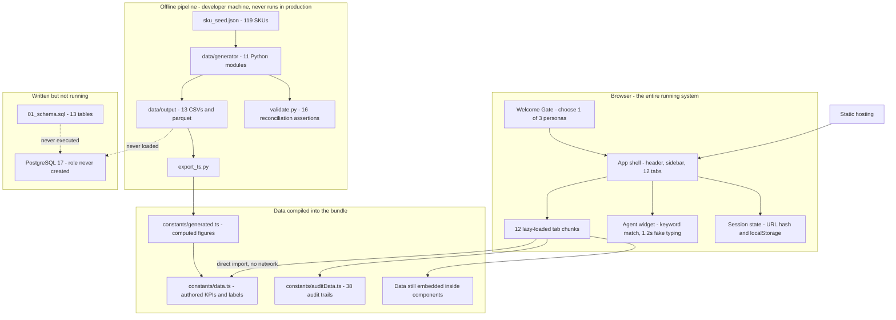
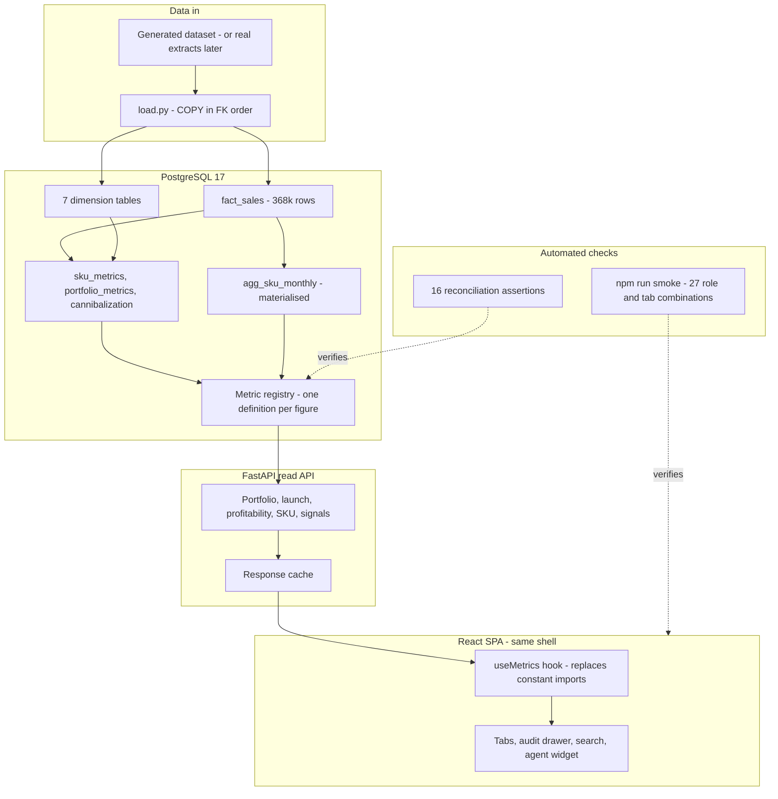
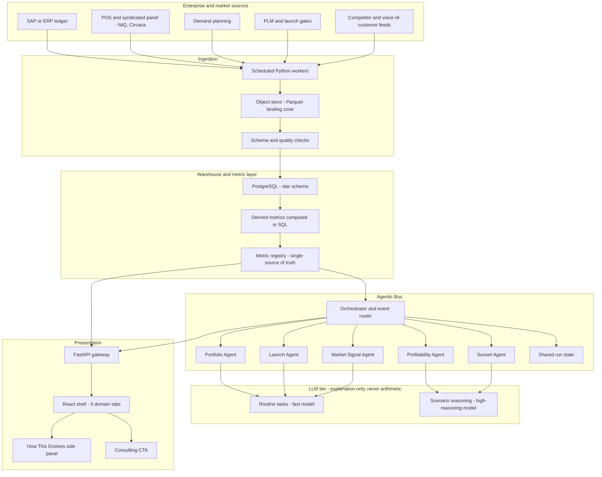

# System Architecture — Now, Next, Future

**Date:** 20 September 2026
**Companion to:** [`architecture_proposal.md`](architecture_proposal.md) (target state and cost
strategy), [`data_model_specification.md`](data_model_specification.md) (the schema).

Three states rather than two. Going straight from "no backend" to "agent swarm" hides the
step that actually has to happen first: putting real data behind the numbers.

---

## Using these with Excalidraw

Copy a fenced block's contents (without the ```` ```mermaid ```` fence) into Excalidraw's
**Mermaid to Excalidraw** dialog.

Excalidraw's parser only handles **flowchart, sequence and class** diagrams, and it is
stricter than mermaid.live. These diagrams are written to survive it:

- plain rectangles only — no `[( )]` cylinders or `{ }` diamonds
- one edge per line — no `A & B --> C` chaining
- `-->` and `-.->` only — no `<=>`
- every label quoted, no `<br>` or HTML

The existing diagram in `architecture_proposal.md` uses `<=>`, `&` chaining and `<br>`, so it
will not import cleanly. The Future diagram below is an Excalidraw-safe replacement for it.

A few edges carry labels, written as `-->|"text"|`. That is valid Mermaid and normally
imports fine; if your Excalidraw build rejects one, delete the `|"..."|` and the edge still
works. Nothing else depends on them.

---

## Decisions applied

| # | Decision | Why |
| --- | --- | --- |
| 1 | **PostgreSQL** as the warehouse | Already specified in detail — 13 tables, keys, indexes. DuckDB stays an option for analytics later, not the system of record |
| 2 | **FastAPI** for the API | Confirmed by the user on 20 Sep: the backend is Python. The whole data layer already is. The Express `server.ts` was deleted the same day |
| 3 | **Metrics computed in SQL** | One implementation. Python and SQL versions of the same formulas will drift |
| 4 | **Five domain tabs** in the target | The Lab 8 brief requires exactly five; see the tab audit |

---

## 1 · Now

Everything here was verified against the working tree on 20 September, including the
absences: **zero `fetch` calls, zero LLM inference, no database**.



**What this says.** The browser *is* the system. The Python pipeline is real and working, but
it runs on a developer machine and its only output into the app is a generated TypeScript
file. The database exists as a file, not as a running thing.

**The honest weak point.** Two data paths feed the UI — computed (`generated.ts`) and authored
(`data.ts`, `auditData.ts`, embedded). That split is why revenue reads `$473M` on one screen
and `$851M` on another.

**How little of the computed path is actually connected.** `generated.ts` exports seven
figures. Only two reach a component:

| Generated export | Reaches the UI? |
| --- | --- |
| `GENERATED_KPI_VALUES` | Yes — overrides the KPI strip in `data.ts` |
| `GENERATED_REGIONAL_DATA` | Yes — 19 component references |
| `GENERATED_CHANNEL_DATA` | No |
| `GENERATED_STOCKOUT_TOP10` | No |
| `GENERATED_RATIONALIZATION_SCENARIOS` | No |
| `GENERATED_PCI_DRIVERS` | No |
| `GENERATED_TOP_SKUS_REVENUE` | No |

The five unconnected ones were re-exported by `data.ts` and consumed *only* by the Express
server, which was deleted on 20 September. Every screen showing channel performance,
stockouts, rationalization scenarios, PCI drivers or top SKUs is rendering hardcoded values
while a correct computed figure sits unused one import away. This is the concrete shape of
the conflicting-numbers problem, and the aliases are left in place as the wiring points.

---

## 2 · Next

The smallest architecture that makes the demo trustworthy. No agents, no LLM — the goal is
**one set of numbers, served from a real database**.



**What changes.** The four authored data files stop being a source. Every displayed figure —
card, search result, agent reply, audit entry — resolves through the metric registry, which is
the structural fix for the conflicting numbers.

**What does not change.** The React shell, the design system, the tab code. This is a data
swap, not a rewrite.

---

## 3 · Future

The target from `architecture_proposal.md`, corrected and redrawn for Excalidraw.



**The rule that keeps this affordable and correct:** all arithmetic — margin roll-ups,
Pareto concentration, complexity scoring, cannibalization — happens in SQL or Python. The LLM
only *explains* results it is handed. That is both cheaper and the only way the numbers stay
reproducible.

---

## What moves between states

| Component | Now | Next | Future |
| --- | --- | --- | --- |
| Source of figures | Bundled TS constants | PostgreSQL + metric registry | Same, fed by real extracts |
| Data freshness | Regenerated by hand | On load | Scheduled ingestion |
| API | None (Node backend deleted 20 Sep) | FastAPI read API | FastAPI gateway |
| Agents | Keyword matching | Unchanged | 5 real agents + orchestrator |
| LLM | None | None | Tiered, explanation only |
| Tabs | 12 | 12 | 5 |
| Checks | Manual | 16 assertions + smoke in CI | Adds data-quality gates |

---

## Corrections to `architecture_proposal.md`

Worth fixing there, since the numbers are quoted in review:

| Claim | Reality |
| --- | --- |
| "240+ SKUs", "240-SKU catalog" | **119 SKUs** |
| Gantt begins 21 June 2026 | In the past — needs rebasing |
| Model tiers and prices (Gemini 1.5 Pro, GPT-4o, Llama-3-8B) | Dated. Re-verify current models and pricing before quoting a monthly figure |
| "Swap out the mock state in `src/constants/data.ts`" | Partly done — 7 arrays now come from `generated.ts` |
| S3 + Parquet + DuckDB as the store | Superseded: the schema spec commits to PostgreSQL. Keep DuckDB as an analytics option |

---

## Open questions

1. **Where does the launch pipeline live?** Time-to-market and launch success rate are
   required KPIs with no data behind them. They need a launch table with gate dates —
   deferred in the schema spec.
2. **Competitor and VoC ingestion.** The Signal Board needs reviews, pricing and search
   signals. That is a second source with its own grain and refresh cadence, not a derivation
   from sales data.
3. **Does the lab ever need auth?** Three personas are currently chosen from a modal. Real
   role-based access changes the API and the gateway.
